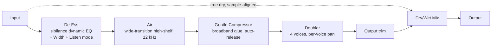

# Architecture

## Signal flow

v0.2.0 (deep-dive voicing pass, `docs/design-brief.md`) retunes all four
stages' defaults/ranges/ballistics for a more "considered instance of the
category" character, without touching the topology above or the zero-latency/
bit-exact-bypass invariants - see each stage's own section below and
`docs/design-brief.md` for the full sourced/reasoned rationale per change.

Everything from De-Ess through Output trim is the "wet" path, owned by `SeraphEngine` (`src/dsp/SeraphEngine.{h,cpp}`). Because nothing in that chain adds reported host latency (see [Latency](#latency) below), the final Mix stage is a plain sample-aligned crossfade between the untouched input and the fully processed signal - no `DryWetMixer`/latency-compensation delay line is needed, unlike a plugin with an oversampled nonlinearity (contrast `overture`'s `OvertureEngine`).

The Gentle Compressor stage (added in M1) sits between Air and the Doubler: dynamics are evened out before the doubler duplicates the signal into four voices, so all four doubled voices track a consistent main signal rather than the doubler amplifying whatever peaks happen to be present in the raw input.

## Module map

| Directory | Responsibility |
|---|---|
| `src/dsp` | All audio-thread DSP: `DeEsser` (single-band dynamic-EQ sibilance reduction with a user-facing detection-bandwidth control, plus a sibilance-listen/solo mode), `GentleCompressor` (hand-rolled broadband downward compressor with a program-dependent auto-release, bit-exact bypass at 0%), `Doubler` (four-voice modulated-delay detune/pan effect), and `SeraphEngine` (wires them together with the Air shelf, output trim, and the final dry/wet crossfade). No allocation, locks, or I/O once `prepare()` has run. Independent of `juce::AudioProcessor` so it is directly unit-testable (see `tests/EngineTests.cpp`, `tests/DeepDiveTests.cpp`). |
| `src/params` | Parameter layout and `AudioProcessorValueTreeState` definitions - parameter IDs, ranges, defaults. Single source of truth for what a preset captures. |
| `src/presets` | M2 preset system (`.scaffold/specs/preset-system-m2.md`) - `PresetManager` (factory/user preset discovery, load/save/import/export, dirty tracking, default resolution) and `PresetBar` (the editor's preset strip). Copied verbatim from sibling plugin nave, the suite's M2 pilot - see nave's `docs/preset-system-notes.md` for the replication recipe. `Localisation.{h,cpp}` installs the German frame-string translation (`resources/i18n/de.txt`). |
| `src/PluginProcessor.*` | Host plumbing: APVTS construction, `prepareToPlay`/`processBlock`/`reset`, latency reporting (always 0), state save/load, and owning the `PresetManager` instance. Reads APVTS values and pushes them into `SeraphEngine` every block; does not implement any DSP itself. |
| `src/PluginEditor.*` | A simple, functional v0.1/v0.2 GUI: a `PresetBar` strip docked at the top, then one rotary slider per float parameter plus a toggle button for De-Ess Listen (two rows of six controls), bound via `SliderAttachment`/`ButtonAttachment`. A custom vector-drawn GUI is a later milestone (M3). |

Dependency direction is one-way: `PluginEditor` -> `params` (via attachments) and `PluginProcessor` -> `params` + `dsp`. `src/dsp` has no upward dependency on the processor or UI, which is what keeps `SeraphEngine` testable in isolation.

## De-Ess: single-band dynamic EQ, no lookahead

The de-esser is a "spectral subtraction" style dynamic EQ, not a full multiband compressor or a linear-phase FFT de-esser - this is a deliberate choice to keep latency at exactly 0 samples:

1. A 2nd-order IIR bandpass filter (`juce::dsp::IIR::Coefficients::makeBandPass`, Q driven by `DeEssWidth`, see below) centered at `DeEssFreq` isolates the sibilance band from a *copy* of each channel's signal.
2. A one-pole attack/release envelope follower (1 ms attack / 80 ms release) measures that band's level.
3. A hard-knee downward compressor computes a gain-reduction factor: any level above a fixed -28 dBFS threshold is reduced 1:1, clamped to a maximum reduction of `DeEss * 24 dB` (so `DeEss = 0%` caps the maximum reduction at exactly 0 dB).
4. The reduction is applied by adding the bandpassed signal back onto the original, scaled by `(gainFactor - 1)`: `output = input + bandpassed * (gainFactor - 1)`. At `gainFactor == 1` (i.e. `DeEss == 0%`) this adds exactly zero, making `DeEss = 0%` a bit-exact bypass - this is what `tests/EngineTests.cpp`'s null test relies on for this stage.

Detection and reduction are per-channel independent (not stereo-linked); for a vocal channel strip this is an acceptable simplification, documented here rather than left implicit.

### DeEssWidth: detector bandwidth control (v0.2.0)

v1 shipped the detector's bandpass Q as a hidden constant (1.2). `DeEssWidth`
(0-100%, default 40%) exposes it directly: `DeEssWidth` maps linearly to Q,
3.0 (narrow) at 0% down to 0.7 (wide) at 100% (`DeEsser.cpp`'s `widthToQ()`).
This closes the single largest gap identified against the reference de-esser
class in `docs/research-notes.md` (both reference plugins studied expose
detection bandwidth as a primary control; v1 didn't). The Q range itself is
reasoned, not sourced to an exact figure from either reference manual -
flagged explicitly in `docs/design-brief.md` ss5. `DeEssWidth` only changes
which coefficients feed the detector's `makeBandPass` call - the reduction
math and the `DeEss = 0%` bit-exact-bypass construction are unaffected,
verified across the full `DeEssWidth` range by `tests/DeepDiveTests.cpp`.

### De-Ess Listen (sibilance-listen/solo mode)

`DeEssListen` (a boolean parameter, off by default) replaces the de-esser stage's output with the raw detected sibilance band - the same bandpassed signal the detector already computes - regardless of the current `DeEss` amount, so the sibilance region can be tuned by ear via `DeEssFreq` before dialling in any reduction. It is intentionally independent of the `DeEss` amount/bypass branch (implemented as its own early-return inside the per-sample loop in `DeEsser::process()`), and does not otherwise change the detector/envelope state, so turning Listen back off resumes normal reduction without a discontinuity. `DeEssListen == false` is a complete no-op on the rest of `DeEsser::process()` - the existing bypass/reduction code path is untouched when Listen is off, which is what keeps the plugin's null test bit-exact with the new parameter added.

## Air: fixed-frequency high-shelf, wide gentle transition (v0.2.0)

`Air` is a single `juce::dsp::IIR::Coefficients::makeHighShelf` filter fixed at 12 kHz with a gain of `Air` dB, recomputed once per block from a smoothed target value. At `Air == 0 dB` the shelf's RBJ-cookbook coefficients collapse numerically to (very close to) an identity filter - close enough that it does not perturb the null test's -90 dBFS tolerance.

v0.2.0 changes two things, both sourced/reasoned against the "air" shelf reference class in `docs/research-notes.md`:

- **Range narrowed and re-centered**: -12/+12 dB -> **-6/+9 dB**, default +3 dB -> **+2 dB**, matching the reference class's effective ~5-6 dB max audible lift more closely than v1's ±12 dB (at v1's hotter settings the fixed-Q 12 kHz shelf read as EQ boost, not "air").
- **Explicit shelf Q lowered**: the Butterworth-Q default (~0.707) -> **0.5** (`SeraphEngine::airShelfQ`), widening the transition band so it starts rising roughly an octave earlier and reaches full gain roughly an octave later - a standard, real-time-safe way to approximate the reference unit's gentle, multi-octave-feeling curve without a second filter stage or added latency. The exact Q value is reasoned, not measured (no source publishes the reference unit's filter-design coefficients) - flagged explicitly in `docs/design-brief.md` ss5. `tests/DeepDiveTests.cpp`'s Air curve-shape test measures the magnitude response at 1/6/12/20 kHz to confirm the widened transition is actually present, not just documented.

## Gentle Compressor: broadband glue with program-dependent auto-release (v0.2.0)

`GentleCompressor` (`src/dsp/GentleCompressor.{h,cpp}`) sits after Air and before the Doubler. It is a hand-rolled feed-forward downward compressor (not a wrapper around `juce::dsp::Compressor`) built the same way as `DeEsser`'s detector: a one-pole attack (15 ms) envelope follower on the squared signal, a hard-knee gain-reduction formula above a threshold, and a single `Comp` knob (0-100%) that scales both threshold (0 dBFS down to -20 dBFS) and ratio (1:1 up to a deliberately gentle 3:1) together. `Comp == 0%` is a bit-exact bypass, exactly like `DeEss`. Detection/reduction is per-channel independent, the same documented simplification `DeEsser` uses. No automatic makeup gain is applied - `Comp` trades level for glue, and `Output` is there to compensate perceived loudness changes, keeping the plugin's minimal-knob philosophy (one knob per effect stage, no hidden threshold/ratio/attack/release sub-menu).

**v0.2.0's auto-release** replaces v1's single fixed 150 ms release with a program-dependent blend, directly sourced from the reference glue-compressor class's single most-cited defining feature (`docs/research-notes.md` ss3): two envelope followers share the attack path but run distinct release time constants (`envelopeFast`, ~150 ms - identical to v1's old fixed release; `envelopeSlow`, ~1.0 s). A per-channel blend weight `releaseWeight` (0 = fully fast, 1 = fully slow) is itself a smoothed one-pole value - never switched - that snaps quickly (~20 ms) toward the fast path on a fresh transient and drifts slowly (~500 ms) toward the slow path the longer gain reduction has been continuously active. The reduction math reads the blended envelope `envelopeFast * (1 - releaseWeight) + envelopeSlow * releaseWeight`, so release recovers faster after an isolated transient than after sustained reduction (transparent on transients, glued on sustained program material) with no zipper/stepping at the blend boundary - both properties are directly tested in `tests/DeepDiveTests.cpp`. The exact time constants are reasoned, not sourced to the reference class's proprietary internal timing - flagged explicitly in `docs/design-brief.md` ss5. `Comp == 0%` remains a bit-exact bypass: the auto-release envelope state still advances underneath the skipped reduction computation, exactly like v1's single-envelope bypass did.

## Doubler: click-free detune via modulated delay, not a compensation delay

The doubler derives a mono sum of the input and feeds it into **four** independent, continuously modulated delay lines (`juce::dsp::DelayLine<float, Linear>`), each with its own fixed pan position reached at `DoubleWidth == 100%` (a small-choir spread rather than a single symmetric L/R pair):

| Voice | Base delay | LFO rate | Pan at 100% width |
|---|---|---|---|
| Outer left | 9 ms | 0.23 Hz | -1.0 (hard left) |
| Outer right | 24 ms | 0.31 Hz | +1.0 (hard right) |
| Inner left | 13 ms | 0.17 Hz | -1/3 |
| Inner right | 19 ms | 0.37 Hz | +1/3 |

(The outer pair is the original v0.1 two-voice doubler, unchanged in role; the inner pair was added in M1.) The differing base delays, LFO rates, and starting phases are deliberate: a single shared LFO applied to all voices would just sound like one voice with a stereo image, not four independently drifting doubles.

**v0.2.0** re-centers the base delays from 13/17/23/29 ms into this 9-24 ms neighborhood, sourced against the doubler reference class in `docs/research-notes.md` (its tight end ~8-12 ms sets the tight end here; its outer end ~6-25 ms sets the outer end) - v1's shortest voice (13 ms) already sat at the outer edge of "tight double" territory, and its longest (29 ms) drifted into chorus/slapback territory. LFO rates/phases/pan roles are unchanged (no reference source publishes exact 4-voice LFO rates).

Each voice's delay is modulated sinusoidally: `delay(t) = base + depth * sin(2*pi*rate*t)`. For a sinusoidally modulated delay, the instantaneous playback-rate deviation from 1 is `depth * 2*pi*rate`; `DoubleDetune` (in cents, shared across all four voices) is converted to a target peak pitch-ratio deviation (`2^(cents/1200) - 1`) and each voice's `depth` is solved from that (using its own LFO rate) so `DoubleDetune` maps intuitively to "how much wobble", not a raw millisecond value. This is a continuous, smooth modulation (never a sawtooth/reset), which is what makes it click-free - a true discrete pitch shifter would need periodic buffer resets/crossfades and was deliberately not used here.

**v0.2.0** also lowers `DoubleDetune`'s default from 15 to 10 cents (inside the "doesn't sound like an effect" 4-12 cent zone identified across two independent sources in `docs/research-notes.md`) and reshapes its knob taper from linear to a power curve, `cents = 50 * p^2.2` for normalised knob position `p` (`ParameterLayout.cpp`'s `makePowerTaperRange()`), giving the reference-validated 4-20 cent "tight double" register more knob travel than the 20-50 cent "loose chorus" register. The taper only changes the knob-position-to-cents *mapping* - the parameter's stored real-unit value (cents) is unchanged, so this is not a breaking change to saved state (see [Versioning and state migration](#versioning-and-state-migration-v020) below and `docs/design-brief.md` ss6). The range itself (0-50 cents) is unchanged, since the plugin's "small choir spread" goal genuinely needs headroom beyond the reference class's tight-double numbers.

`DoubleWidth` scales each voice's fixed pan position (0% = all four voices centered, a mono-compatible chorus; 100% = the spread in the table above); `Double` scales the combined voices' gain before they're added onto the existing (already de-essed/aired/compressed) signal in the buffer. A `2/numVoices` compensation factor keeps the overall added level consistent regardless of voice count (it reduces to the original v0.1 two-voice gain-staging exactly when `numVoices == 2`). At `Double == 0%` the buffer is left bit-exact untouched (the delay lines/LFO phases still advance internally, fed from live input, so turning `Double` back up doesn't start from stale state) - this is what keeps `Double = 0%` part of the plugin's null test. Mono buffers ignore `DoubleWidth` entirely and sum all four voices at their centered gain, matching the documented v0.1 mono behaviour.

**Deferred: formant-preserving detune.** The M1 DSP issue asked for "formant-preserving detune". A genuinely formant-preserving pitch shift (separating the spectral envelope from the excitation via LPC/cepstral analysis, shifting only the excitation, and reapplying the original envelope) is a substantially larger DSP feature than the other M1 items, and doesn't fit cleanly into this doubler's modulated-delay architecture without real risk to the plugin's two central invariants: zero reported latency and bit-exact bypass at the null-test settings. At the frozen 0-50 cent detune range, the existing continuous-delay-modulation technique is a mild vibrato rather than a large-interval pitch shift, so audible formant coloration ("chipmunking") is not a practical problem at these depths; a dedicated LPC/cepstral formant-correction stage is left as a follow-up ticket (with its own design and test pass) rather than being rushed into this milestone. See the M1 issue for the deferral note.

## Latency

`SeraphEngine::getLatencySamples()` always returns 0, and `SeraphAudioProcessor::prepareToPlay()` reports that via `setLatencySamples()`. This holds regardless of parameter values: the de-esser, Air shelf, and Gentle Compressor are ordinary same-sample processing (no lookahead), and the doubler's delay lines are a musical effect (the "doubling" itself), not a delay inserted to be compensated away - so there is no host-side PDC to account for and no dry-path delay-compensation dance (contrast `overture`'s oversampling-driven `DryWetMixer` usage).

## Versioning and state migration (v0.2.0)

`DeEssWidth` is a new parameter added in v0.2.0 (`ParamIDs::deEssWidth`, default 40%). Loading a v0.1.0-saved session (which has no `deEssWidth` entry in its `AudioProcessorValueTreeState` XML) does not fail or perturb any other parameter - JUCE 8.0.14's `AudioProcessorValueTreeState::replaceState()` leaves a parameter's live value untouched when its own `PARAM` child is absent from the loaded state, and a freshly constructed `SeraphAudioProcessor` already sits at `DeEssWidth`'s `ParameterLayout` default (40%) before `setStateInformation()` ever runs - so the net effect is the documented "falls back to its default" behaviour (`tests/StateTests.cpp`'s tolerant-import test). `Air`'s range narrowing (±12 dB -> -6/+9 dB) is handled the same way any out-of-range `AudioParameterFloat` load is: `setValueNotifyingHost()`/`convertTo0to1()` clamp silently, so an old session's `Air` value outside the new range lands at whichever new-range edge it's closest to, rather than being rejected. `DoubleDetune`'s taper change is not a state-breaking change at all (see the Doubler section above) - only the knob curve, not the stored cents value, changes. No parameter ID was renamed or removed in v0.2.0 - all existing IDs in `src/params/ParameterIds.h` remain valid.

## Parameter smoothing

- **DeEss**, **DeEssFreq**, **DeEssWidth**, **Comp**, **Double**, **DoubleDetune**, **DoubleWidth**, **Air**, and the overall **Mix** are each smoothed with a `juce::SmoothedValue` (multiplicative for `DeEssFreq`, since frequency is perceived logarithmically; linear for the rest) and re-applied once per block - the same standard real-time-safe compromise `overture`'s Tight/Tone filters use, since recomputing IIR/shelf coefficients involves trig calls that aren't cheap to do per sample. `GentleCompressor`'s auto-release blend weight is smoothed internally too (its own one-pole per-sample update, see the Gentle Compressor section above) rather than via a block-rate `SmoothedValue`, since it needs to react within the release ballistics themselves, not just track a UI parameter.
- **Output** is a plain gain stage (`juce::dsp::Gain<float>`), which ramps sample-accurately via its own internal `SmoothedValue`.
- **DeEssListen** is a boolean toggle, applied immediately (not smoothed) - it switches which computation feeds the output sample, not a continuous gain, so there is nothing to ramp.
- All smoothers are seeded to their real starting value in `prepare()` (mirroring `lastTightHz`/etc. in `overture`), so re-preparing (sample-rate change, etc.) never resets a live parameter back to a built-in default mid-session.

## Real-time safety

- `SeraphAudioProcessor::processBlock()` starts with `juce::ScopedNoDenormals`.
- All DSP state (filters, delay lines, the dry-capture scratch buffer) is allocated in `prepare()`/`prepareToPlay()` and never reallocated on the audio thread.
- `reset()` clears all filter/envelope/delay-line state without deallocating (`SeraphEngine::reset()`, called from both `AudioProcessor::reset()` and internally from `prepare()`).
- Parameter values are read via `apvts.getRawParameterValue()` atomics in `processBlock()`, never via `apvts.getParameter()->getValue()` and never via `String`-keyed lookups on the audio thread.
- `SeraphEngine::process()`, `DeEsser::process()`, `GentleCompressor::process()`, and `Doubler::process()` all treat a zero-sample block as a safe no-op before touching any filter/delay-line/envelope state.
- The de-esser's detector frequency is clamped below Nyquist (`clampBelowNyquist` in `DeEsser.cpp`) as defensive insurance against invalid coefficients at unusually low sample rates.
- The doubler's per-sample delay length is clamped to the delay line's allocated capacity (`SeraphEngine`/`Doubler.cpp`) so a pathological detune/rate combination can never read out of bounds.
- If a host ever sends a block larger than `prepareToPlay` was told to expect, `SeraphEngine`'s pre-allocated dry-capture buffer bounds the crossfade to its own capacity rather than reading/writing out of bounds on the overflow tail (documented in `SeraphEngine.h`).
- `PresetManager` (the M2 preset system, `src/presets/`) never touches the audio thread at all - it is only constructed once (in `SeraphAudioProcessor`'s constructor) and otherwise only called from the message thread (`PresetBar`'s button/menu/dialog callbacks). Its one audio-thread-adjacent code path, the `AudioProcessorValueTreeState::Listener::parameterChanged()` override used for dirty-flag tracking, is a single lock-free `std::atomic<bool>` store and nothing else, since JUCE does not document that callback as guaranteed message-thread-only. See `src/presets/PresetManager.h`'s class docs (and sibling plugin nave's `docs/preset-system-notes.md`, the M2 pilot) for the full real-time-safety reasoning.
