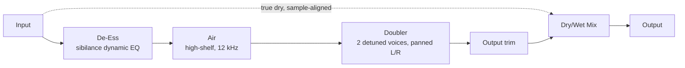

# Architecture

## Signal flow

Everything from De-Ess through Output trim is the "wet" path, owned by `SeraphEngine` (`src/dsp/SeraphEngine.{h,cpp}`). Because nothing in that chain adds reported host latency (see [Latency](#latency) below), the final Mix stage is a plain sample-aligned crossfade between the untouched input and the fully processed signal - no `DryWetMixer`/latency-compensation delay line is needed, unlike a plugin with an oversampled nonlinearity (contrast `overture`'s `OvertureEngine`).

## Module map

| Directory | Responsibility |
|---|---|
| `src/dsp` | All audio-thread DSP: `DeEsser` (single-band dynamic-EQ sibilance reduction), `Doubler` (two-voice modulated-delay detune/pan effect), and `SeraphEngine` (wires them together with the Air shelf, output trim, and the final dry/wet crossfade). No allocation, locks, or I/O once `prepare()` has run. Independent of `juce::AudioProcessor` so it is directly unit-testable (see `tests/EngineTests.cpp`). |
| `src/params` | Parameter layout and `AudioProcessorValueTreeState` definitions - parameter IDs, ranges, defaults. Single source of truth for what a preset captures. |
| `src/PluginProcessor.*` | Host plumbing: APVTS construction, `prepareToPlay`/`processBlock`/`reset`, latency reporting (always 0), state save/load. Reads APVTS values and pushes them into `SeraphEngine` every block; does not implement any DSP itself. |
| `src/PluginEditor.*` | A simple, functional v0.1 GUI: one rotary slider per parameter (two rows of four) bound via `SliderAttachment`. A custom vector-drawn GUI is a later milestone. |

Dependency direction is one-way: `PluginEditor` -> `params` (via attachments) and `PluginProcessor` -> `params` + `dsp`. `src/dsp` has no upward dependency on the processor or UI, which is what keeps `SeraphEngine` testable in isolation.

## De-Ess: single-band dynamic EQ, no lookahead

The de-esser is a "spectral subtraction" style dynamic EQ, not a full multiband compressor or a linear-phase FFT de-esser - this is a deliberate choice to keep latency at exactly 0 samples:

1. A 2nd-order IIR bandpass filter (`juce::dsp::IIR::Coefficients::makeBandPass`, Q = 1.2) centered at `DeEssFreq` isolates the sibilance band from a *copy* of each channel's signal.
2. A one-pole attack/release envelope follower (1 ms attack / 80 ms release) measures that band's level.
3. A hard-knee downward compressor computes a gain-reduction factor: any level above a fixed -28 dBFS threshold is reduced 1:1, clamped to a maximum reduction of `DeEss * 24 dB` (so `DeEss = 0%` caps the maximum reduction at exactly 0 dB).
4. The reduction is applied by adding the bandpassed signal back onto the original, scaled by `(gainFactor - 1)`: `output = input + bandpassed * (gainFactor - 1)`. At `gainFactor == 1` (i.e. `DeEss == 0%`) this adds exactly zero, making `DeEss = 0%` a bit-exact bypass - this is what `tests/EngineTests.cpp`'s null test relies on for this stage.

Detection and reduction are per-channel independent (not stereo-linked); for a vocal channel strip this is an acceptable simplification, documented here rather than left implicit.

## Air: fixed-frequency high-shelf

`Air` is a single `juce::dsp::IIR::Coefficients::makeHighShelf` filter fixed at 12 kHz (Butterworth Q, within the ~10-16 kHz "Air" register described in the DSP spec) with a gain of `Air` dB, recomputed once per block from a smoothed target value. At `Air == 0 dB` the shelf's RBJ-cookbook coefficients collapse numerically to (very close to) an identity filter - close enough that it does not perturb the null test's -90 dBFS tolerance.

## Doubler: click-free detune via modulated delay, not a compensation delay

The doubler derives a mono sum of the input and feeds it into two independent, continuously modulated delay lines (`juce::dsp::DelayLine<float, Linear>`):

- Voice A: 17 ms base delay, LFO rate 0.23 Hz.
- Voice B: 23 ms base delay, LFO rate 0.31 Hz, starting 180° out of phase with A.

The differing base delays, LFO rates, and starting phases are deliberate: a single shared LFO applied to both voices would just sound like one voice with a stereo image, not two independently drifting doubles.

Each voice's delay is modulated sinusoidally: `delay(t) = base + depth * sin(2*pi*rate*t)`. For a sinusoidally modulated delay, the instantaneous playback-rate deviation from 1 is `depth * 2*pi*rate`; `DoubleDetune` (in cents) is converted to a target peak pitch-ratio deviation (`2^(cents/1200) - 1`) and `depth` is solved from that so `DoubleDetune` maps intuitively to "how much wobble", not a raw millisecond value. This is a continuous, smooth modulation (never a sawtooth/reset), which is what makes it click-free - a true discrete pitch shifter would need periodic buffer resets/crossfades and was deliberately not used here.

`DoubleWidth` pans voice A towards the left channel and voice B towards the right (equal-power-ish linear crossfade between "both centered" at 0% and "hard L/R" at 100%); `Double` scales the combined voices' gain before they're added onto the existing (already de-essed/aired) signal in the buffer. At `Double == 0%` the buffer is left bit-exact untouched (the delay lines/LFO phases still advance internally, fed from live input, so turning `Double` back up doesn't start from stale state) - this is what keeps `Double = 0%` part of the plugin's null test.

## Latency

`SeraphEngine::getLatencySamples()` always returns 0, and `SeraphAudioProcessor::prepareToPlay()` reports that via `setLatencySamples()`. This holds regardless of parameter values: the de-esser and Air shelf are ordinary same-sample IIR processing, and the doubler's delay lines are a musical effect (the "doubling" itself), not a delay inserted to be compensated away - so there is no host-side PDC to account for and no dry-path delay-compensation dance (contrast `overture`'s oversampling-driven `DryWetMixer` usage).

## Parameter smoothing

- **DeEss**, **DeEssFreq**, **Double**, **DoubleDetune**, **DoubleWidth**, **Air**, and the overall **Mix** are each smoothed with a `juce::SmoothedValue` (multiplicative for `DeEssFreq`, since frequency is perceived logarithmically; linear for the rest) and re-applied once per block - the same standard real-time-safe compromise `overture`'s Tight/Tone filters use, since recomputing IIR/shelf coefficients involves trig calls that aren't cheap to do per sample.
- **Output** is a plain gain stage (`juce::dsp::Gain<float>`), which ramps sample-accurately via its own internal `SmoothedValue`.
- All smoothers are seeded to their real starting value in `prepare()` (mirroring `lastTightHz`/etc. in `overture`), so re-preparing (sample-rate change, etc.) never resets a live parameter back to a built-in default mid-session.

## Real-time safety

- `SeraphAudioProcessor::processBlock()` starts with `juce::ScopedNoDenormals`.
- All DSP state (filters, delay lines, the dry-capture scratch buffer) is allocated in `prepare()`/`prepareToPlay()` and never reallocated on the audio thread.
- `reset()` clears all filter/envelope/delay-line state without deallocating (`SeraphEngine::reset()`, called from both `AudioProcessor::reset()` and internally from `prepare()`).
- Parameter values are read via `apvts.getRawParameterValue()` atomics in `processBlock()`, never via `apvts.getParameter()->getValue()` and never via `String`-keyed lookups on the audio thread.
- `SeraphEngine::process()`, `DeEsser::process()`, and `Doubler::process()` all treat a zero-sample block as a safe no-op before touching any filter/delay-line state.
- The de-esser's detector frequency is clamped below Nyquist (`clampBelowNyquist` in `DeEsser.cpp`) as defensive insurance against invalid coefficients at unusually low sample rates.
- The doubler's per-sample delay length is clamped to the delay line's allocated capacity (`SeraphEngine`/`Doubler.cpp`) so a pathological detune/rate combination can never read out of bounds.
- If a host ever sends a block larger than `prepareToPlay` was told to expect, `SeraphEngine`'s pre-allocated dry-capture buffer bounds the crossfade to its own capacity rather than reading/writing out of bounds on the overflow tail (documented in `SeraphEngine.h`).
