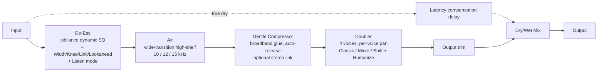

# Architecture

## Signal flow


```mermaid
flowchart LR
    IN[Input] --> DEESS[De-Ess<br/>sibilance dynamic EQ<br/>+ Width/Knee/Link/Lookahead<br/>+ Listen mode]
    DEESS --> AIR[Air<br/>wide-transition high-shelf<br/>10 / 12 / 15 kHz]
    AIR --> COMP[Gentle Compressor<br/>broadband glue, auto-release<br/>optional stereo link]
    COMP --> DOUBLE[Doubler<br/>4 voices, per-voice pan<br/>Classic / Micro / Shift + Humanize]
    DOUBLE --> OUT_GAIN[Output trim]
    IN -.->|true dry| COMPDLY[Latency compensation delay]
    COMPDLY -.-> MIX[Dry/Wet Mix]
    OUT_GAIN --> MIX
    MIX --> OUT[Output]
```

v0.2.0 (deep-dive voicing pass, `docs/design-brief.md`) retunes all four
stages' defaults/ranges/ballistics for a more "considered instance of the
category" character, without touching the topology above or the zero-latency/
bit-exact-bypass invariants - see each stage's own section below and
`docs/design-brief.md` for the full sourced/reasoned rationale per change.

v0.3.0 adds two doubler engines, humanisation, three de-esser controls, two
stereo links and a selectable Air corner - and, for the first time, lifts the
zero-latency invariant. See [Latency](#latency) for what that means and why the
dry path now runs through a compensation delay.

Everything from De-Ess through Output trim is the "wet" path, owned by `SeraphEngine` (`src/dsp/SeraphEngine.{h,cpp}`). The final Mix stage is a crossfade between the captured input and the fully processed signal; when the chain reports latency, the captured dry runs through a compensation delay of exactly that length first, so the crossfade stays sample-aligned in every mode. At zero reported latency that delay is short-circuited and the dry path is bit-exact, which is what keeps the existing null tests valid.

### Sub-block parameter smoothing (v0.3.0)

`SeraphEngine::process()` iterates internally in slices of at most
`parameterSliceSamples` (32), running the whole chain on each slice, so every
smoothed parameter advances several times per host block instead of once.
Through v0.2.0 a 4096-sample block moved each smoothed value in a single step -
a block-sized staircase, audible as zipper on fast automation. At static
settings the smoothed values are converged constants, so the sliced path is
bit-identical to the unsliced one; that is pinned by the compatibility null
test in `tests/EngineTests.cpp`, which renders a v0.2.0-shaped session at
three sample rates and two block sizes and `memcmp`s the result.

The Air shelf's coefficient recompute is the one deliberate exception and
stays at block rate: the shelf gain moves on a 50 ms ramp, and recomputing a
biquad every 32 samples would spend real CPU chasing a value that cannot
audibly change that fast.

The Gentle Compressor stage (added in M1) sits between Air and the Doubler: dynamics are evened out before the doubler duplicates the signal into four voices, so all four doubled voices track a consistent main signal rather than the doubler amplifying whatever peaks happen to be present in the raw input.

## Module map

| Directory | Responsibility |
|---|---|
| `src/dsp` | All audio-thread DSP: `DeEsser` (single-band dynamic-EQ sibilance reduction with detection-bandwidth, soft-knee, stereo-link and lookahead controls, plus a sibilance-listen/solo mode), `GentleCompressor` (hand-rolled broadband downward compressor with program-dependent auto-release and optional stereo link, bit-exact bypass at 0%), `Doubler` (four-voice detune/pan effect with three selectable engines), its engines `MicroPitchShifter` and `SpectralShifter`, the `VoiceHumanizer` that drifts them, the `SlidingMinimum` and `AlignmentDelay` primitives, and `SeraphEngine` (wires them together with the Air shelf, output trim, sub-block slicing, and the final dry/wet crossfade). No allocation, locks, or I/O once `prepare()` has run. Independent of `juce::AudioProcessor` so it is directly unit-testable (see `tests/EngineTests.cpp`, `tests/DeepDiveTests.cpp`). |
| `src/params` | Parameter layout and `AudioProcessorValueTreeState` definitions - parameter IDs, ranges, defaults. Single source of truth for what a preset captures. |
| `src/presets` | M2 preset system (`.scaffold/specs/preset-system-m2.md`) - `PresetManager` (factory/user preset discovery, load/save/import/export, dirty tracking, default resolution) and `PresetBar` (the editor's preset strip). Copied verbatim from sibling plugin nave, the suite's M2 pilot - see nave's `docs/preset-system-notes.md` for the replication recipe. `Localisation.{h,cpp}` installs the German frame-string translation (`resources/i18n/de.txt`). |
| `src/PluginProcessor.*` | Host plumbing: APVTS construction, `prepareToPlay`/`processBlock`/`reset`, dynamic latency reporting, state save/load (including the schema version stamp), and owning the `PresetManager` instance. Reads APVTS values and pushes them into `SeraphEngine` every block; does not implement any DSP itself. |
| `src/PluginEditor.*` | A simple, functional GUI: a `PresetBar` strip docked at the top, then one rotary slider per float parameter, a toggle per boolean and a combo box per choice parameter (four rows of six), bound via `Slider`/`Button`/`ComboBoxAttachment`. v0.3.0 extends the same generic grid from 11 to 19 controls rather than redesigning it. A custom vector-drawn GUI is a later milestone (M3). |

Dependency direction is one-way: `PluginEditor` -> `params` (via attachments) and `PluginProcessor` -> `params` + `dsp`. `src/dsp` has no upward dependency on the processor or UI, which is what keeps `SeraphEngine` testable in isolation.

## De-Ess: single-band dynamic EQ, no lookahead

The de-esser is a "spectral subtraction" style dynamic EQ, not a full multiband compressor or a linear-phase FFT de-esser - this is a deliberate choice to keep latency at exactly 0 samples:

1. A 2nd-order IIR bandpass filter (`juce::dsp::IIR::Coefficients::makeBandPass`, Q driven by `DeEssWidth`, see below) centered at `DeEssFreq` isolates the sibilance band from a *copy* of each channel's signal.
2. A one-pole attack/release envelope follower (1 ms attack / 80 ms release) measures that band's level.
3. A hard-knee downward compressor computes a gain-reduction factor: any level above a fixed -28 dBFS threshold is reduced 1:1, clamped to a maximum reduction of `DeEss * 24 dB` (so `DeEss = 0%` caps the maximum reduction at exactly 0 dB).
4. The reduction is applied by adding the bandpassed signal back onto the original, scaled by `(gainFactor - 1)`: `output = input + bandpassed * (gainFactor - 1)`. At `gainFactor == 1` (i.e. `DeEss == 0%`) this adds exactly zero, making `DeEss = 0%` a bit-exact bypass - this is what `tests/EngineTests.cpp`'s null test relies on for this stage.

### De-Ess: link, knee and lookahead (v0.3.0)

Detection and reduction were per-channel independent through v0.2.0. `deEssLink`
now optionally drives one shared gain from `max(level_L, level_R)`, so a
hard-panned ess cannot pull the stereo image sideways. Off reproduces the old
behaviour exactly - the process loop was reordered from channel-outer to
sample-outer so the linked detector can see every channel's envelope for the
same sample, and because per-channel state is independent that reordering is
bit-identical.

`deEssKnee` (0-12 dB) interpolates the gain reduction quadratically across a
knee around the fixed -28 dBFS threshold, matching the hard-knee value *and*
slope at both ends. At width 0 the v0.2.0 expression is evaluated verbatim, so
the default is bit-identical rather than merely equivalent.

**`deEssLookahead` (0-2 ms) has a load-bearing alignment requirement.** The
topology is `output = input + bandpassed * (gain - 1)`, which only *attenuates*
if the bandpassed term is time-aligned with the audio it is subtracted from.
The implemented form is

```
output[n] = x[n - L] + bandpassed[n - L] * (gain[n] - 1)
```

- BOTH the input and the bandpassed signal are delayed by `L`, while the
detector runs on the *undelayed* band (that is what buys the preview time).
Delaying the band is legitimate because the bandpass is LTI, so delaying its
output equals filtering the delayed input.

The natural-sounding alternative - "delay the audio path, run the detector on
the undelayed input" - would leave the band undelayed and misalign the two by
`L`. Sibilance is noise-like and effectively decorrelated at a 2 ms lag, so the
"subtraction" would then add roughly 0.8x the band's power at maximum
reduction: the de-esser would *boost* esses. Both halves of the contract are
pinned by tests - bit-exact delayed passthrough at unity gain, and
attenuate-never-boost at maximum reduction on decorrelated noise.

The gain passes through a preallocated sliding minimum (monotonic wedge,
`src/dsp/SlidingMinimum.h`) over the lookahead window before being applied, so
it reaches its target before the delayed ess arrives rather than chasing it. At
zero lookahead the window is one sample and the wedge returns its argument
unchanged, which is what keeps the default bit-identical.

The lookahead length is a read offset into a ring buffer sized once in
`prepare()`, so changing it neither reallocates nor drops samples; the old and
new read positions are crossfaded over 10 ms so the time-base change is not a
step.

`DeEss == 0%` remains a bit-exact bypass. With lookahead engaged it is a
bit-exact *delayed* bypass, so the reported latency stays truthful at every
amount setting.

### DeEssWidth: detector bandwidth control (v0.2.0)

v1 shipped the detector's bandpass Q as a hidden constant (1.2). `DeEssWidth`
(0-100%, default 40%) exposes it directly: `DeEssWidth` maps linearly to Q,
3.0 (narrow) at 0% down to 0.7 (wide) at 100% (`DeEsser.cpp`'s `widthToQ()`).
This closes the single largest gap identified against the reference de-esser
class in `docs/research-notes.md` (both reference plugins studied expose
detection bandwidth as a primary control; v1 didn't). The Q range itself is
reasoned, not sourced to an exact figure from either reference manual -
flagged explicitly in `docs/design-brief.md` ss5. `DeEssWidth` only changes
which coefficients feed the detector's `makeBandPass` call - the reduction
math and the `DeEss = 0%` bit-exact-bypass construction are unaffected,
verified across the full `DeEssWidth` range by `tests/DeepDiveTests.cpp`.

### De-Ess Listen (sibilance-listen/solo mode)

`DeEssListen` (a boolean parameter, off by default) replaces the de-esser stage's output with the raw detected sibilance band - the same bandpassed signal the detector already computes - regardless of the current `DeEss` amount, so the sibilance region can be tuned by ear via `DeEssFreq` before dialling in any reduction. It is intentionally independent of the `DeEss` amount/bypass branch (implemented as its own early-return inside the per-sample loop in `DeEsser::process()`), and does not otherwise change the detector/envelope state, so turning Listen back off resumes normal reduction without a discontinuity. `DeEssListen == false` is a complete no-op on the rest of `DeEsser::process()` - the existing bypass/reduction code path is untouched when Listen is off, which is what keeps the plugin's null test bit-exact with the new parameter added.

## Air: fixed-frequency high-shelf, wide gentle transition (v0.2.0)

**v0.3.0** makes the corner selectable via `airFreq` (10/12/15 kHz, default
12 kHz - the constant v0.1/v0.2 always used, hence neutral). The design
frequency is clamped to `min(choice, 0.45 * fs)` as a house-rule backstop for
exotic sample rates; 15 kHz is below Nyquist even at 44.1 kHz, so the clamp
never engages at the shipped choices. Shelf cramping at 15 kHz on a 44.1 kHz
session is accepted and documented - a decramped (matched-Z) design would
change the sound at the default setting and needs its own voicing pass.

`Air` is a single `juce::dsp::IIR::Coefficients::makeHighShelf` filter at the selected corner with a gain of `Air` dB, recomputed once per block from a smoothed target value. At `Air == 0 dB` the shelf's RBJ-cookbook coefficients collapse numerically to (very close to) an identity filter - close enough that it does not perturb the null test's -90 dBFS tolerance.

v0.2.0 changes two things, both sourced/reasoned against the "air" shelf reference class in `docs/research-notes.md`:

- **Range narrowed and re-centered**: -12/+12 dB -> **-6/+9 dB**, default +3 dB -> **+2 dB**, matching the reference class's effective ~5-6 dB max audible lift more closely than v1's ±12 dB (at v1's hotter settings the fixed-Q 12 kHz shelf read as EQ boost, not "air").
- **Explicit shelf Q lowered**: the Butterworth-Q default (~0.707) -> **0.5** (`SeraphEngine::airShelfQ`), widening the transition band so it starts rising roughly an octave earlier and reaches full gain roughly an octave later - a standard, real-time-safe way to approximate the reference unit's gentle, multi-octave-feeling curve without a second filter stage or added latency. The exact Q value is reasoned, not measured (no source publishes the reference unit's filter-design coefficients) - flagged explicitly in `docs/design-brief.md` ss5. `tests/DeepDiveTests.cpp`'s Air curve-shape test measures the magnitude response at 1/6/12/20 kHz to confirm the widened transition is actually present, not just documented.

## Gentle Compressor: broadband glue with program-dependent auto-release (v0.2.0)

**v0.3.0** adds `compLink`: one shared envelope pair and one auto-release state
machine driven by `max` across channels, so the stereo image stays put under
compression. Off is bit-identical to v0.2.0.

`GentleCompressor` (`src/dsp/GentleCompressor.{h,cpp}`) sits after Air and before the Doubler. It is a hand-rolled feed-forward downward compressor (not a wrapper around `juce::dsp::Compressor`) built the same way as `DeEsser`'s detector: a one-pole attack (15 ms) envelope follower on the squared signal, a hard-knee gain-reduction formula above a threshold, and a single `Comp` knob (0-100%) that scales both threshold (0 dBFS down to -20 dBFS) and ratio (1:1 up to a deliberately gentle 3:1) together. `Comp == 0%` is a bit-exact bypass, exactly like `DeEss`. Detection/reduction is per-channel independent, the same documented simplification `DeEsser` uses. No automatic makeup gain is applied - `Comp` trades level for glue, and `Output` is there to compensate perceived loudness changes, keeping the plugin's minimal-knob philosophy (one knob per effect stage, no hidden threshold/ratio/attack/release sub-menu).

**v0.2.0's auto-release** replaces v1's single fixed 150 ms release with a program-dependent blend, directly sourced from the reference glue-compressor class's single most-cited defining feature (`docs/research-notes.md` ss3): two envelope followers share the attack path but run distinct release time constants (`envelopeFast`, ~150 ms - identical to v1's old fixed release; `envelopeSlow`, ~1.0 s). A per-channel blend weight `releaseWeight` (0 = fully fast, 1 = fully slow) is itself a smoothed one-pole value - never switched - that snaps quickly (~20 ms) toward the fast path on a fresh transient and drifts slowly (~500 ms) toward the slow path the longer gain reduction has been continuously active. The reduction math reads the blended envelope `envelopeFast * (1 - releaseWeight) + envelopeSlow * releaseWeight`, so release recovers faster after an isolated transient than after sustained reduction (transparent on transients, glued on sustained program material) with no zipper/stepping at the blend boundary - both properties are directly tested in `tests/DeepDiveTests.cpp`. The exact time constants are reasoned, not sourced to the reference class's proprietary internal timing - flagged explicitly in `docs/design-brief.md` ss5. `Comp == 0%` remains a bit-exact bypass: the auto-release envelope state still advances underneath the skipped reduction computation, exactly like v1's single-envelope bypass did.

## Doubler: click-free detune via modulated delay, not a compensation delay

The doubler derives a mono sum of the input and feeds it into **four** independent, continuously modulated delay lines (`juce::dsp::DelayLine<float, Linear>`), each with its own fixed pan position reached at `DoubleWidth == 100%` (a small-choir spread rather than a single symmetric L/R pair):

| Voice | Base delay | LFO rate | Pan at 100% width |
|---|---|---|---|
| Outer left | 9 ms | 0.23 Hz | -1.0 (hard left) |
| Outer right | 24 ms | 0.31 Hz | +1.0 (hard right) |
| Inner left | 13 ms | 0.17 Hz | -1/3 |
| Inner right | 19 ms | 0.37 Hz | +1/3 |

(The outer pair is the original v0.1 two-voice doubler, unchanged in role; the inner pair was added in M1.) The differing base delays, LFO rates, and starting phases are deliberate: a single shared LFO applied to all voices would just sound like one voice with a stereo image, not four independently drifting doubles.

**v0.2.0** re-centers the base delays from 13/17/23/29 ms into this 9-24 ms neighborhood, sourced against the doubler reference class in `docs/research-notes.md` (its tight end ~8-12 ms sets the tight end here; its outer end ~6-25 ms sets the outer end) - v1's shortest voice (13 ms) already sat at the outer edge of "tight double" territory, and its longest (29 ms) drifted into chorus/slapback territory. LFO rates/phases/pan roles are unchanged (no reference source publishes exact 4-voice LFO rates).

Each voice's delay is modulated sinusoidally: `delay(t) = base + depth * sin(2*pi*rate*t)`. For a sinusoidally modulated delay, the instantaneous playback-rate deviation from 1 is `depth * 2*pi*rate`; `DoubleDetune` (in cents, shared across all four voices) is converted to a target peak pitch-ratio deviation (`2^(cents/1200) - 1`) and each voice's `depth` is solved from that (using its own LFO rate) so `DoubleDetune` maps intuitively to "how much wobble", not a raw millisecond value. This is a continuous, smooth modulation (never a sawtooth/reset), which is what makes it click-free - a true discrete pitch shifter would need periodic buffer resets/crossfades and was deliberately not used here.

**v0.2.0** also lowers `DoubleDetune`'s default from 15 to 10 cents (inside the "doesn't sound like an effect" 4-12 cent zone identified across two independent sources in `docs/research-notes.md`) and reshapes its knob taper from linear to a power curve, `cents = 50 * p^2.2` for normalised knob position `p` (`ParameterLayout.cpp`'s `makePowerTaperRange()`), giving the reference-validated 4-20 cent "tight double" register more knob travel than the 20-50 cent "loose chorus" register. The taper only changes the knob-position-to-cents *mapping* - the parameter's stored real-unit value (cents) is unchanged, so this is not a breaking change to saved state (see [Versioning and state migration](#versioning-and-state-migration-v020) below and `docs/design-brief.md` ss6). The range itself (0-50 cents) is unchanged, since the plugin's "small choir spread" goal genuinely needs headroom beyond the reference class's tight-double numbers.

`DoubleWidth` scales each voice's fixed pan position (0% = all four voices centered, a mono-compatible chorus; 100% = the spread in the table above); `Double` scales the combined voices' gain before they're added onto the existing (already de-essed/aired/compressed) signal in the buffer. A `2/numVoices` compensation factor keeps the overall added level consistent regardless of voice count (it reduces to the original v0.1 two-voice gain-staging exactly when `numVoices == 2`). At `Double == 0%` the buffer is left bit-exact untouched (the delay lines/LFO phases still advance internally, fed from live input, so turning `Double` back up doesn't start from stale state) - this is what keeps `Double = 0%` part of the plugin's null test. Mono buffers ignore `DoubleWidth` entirely and sum all four voices at their centered gain, matching the documented v0.1 mono behaviour.

### Doubler modes (v0.3.0)

Everything above describes **Classic**, which is still the default and is
unchanged byte for byte. `doubleMode` selects between it and two engines that
produce a genuinely constant interval rather than a wobble. All three share the
same four voices, base delays, pan positions and Amount/Detune/Width laws, so
switching changes only how the detune is produced.

In Micro and Shift the Detune knob's cents are distributed across the voices by
`voiceDetuneScalers` = {-1.0, +1.0, -0.45, +0.55}. The inner pair is
deliberately asymmetric so the four voices never settle into a coherent beating
relationship - the same reasoning behind the H3000 MicroPitch's -9/+11 cent
lineage.

**Micro** (`src/dsp/MicroPitchShifter.{h,cpp}`) is a dual-head constant-ratio
delay-line shifter with cubic Catmull-Rom interpolation. A delay whose length
ramps at `dtau/dt = 1 - r` produces exactly the pitch ratio `r`; a finite delay
line cannot ramp forever, so each head sweeps a fixed 50 ms range and is
periodically reset, crossfading with the other. Two details are load-bearing
and documented at length in the header:

- The sweep interval is `[base, base + 50 ms]`, deliberately **not** centred on
  the base delay. Centring it would need negative (future-reading) delays for
  every voice, so a literal implementation would clamp at the delay line's
  floor and break the constant ratio. Sweeping upward keeps the instantaneous
  delay at or above `base` at every sample.
- The crossfade gains are arranged so that whichever head is wrapping is silent
  at that instant.

A consequence is re-documented rather than hidden: because the active head sits
mid-sweep whenever the other one wraps, the mean voice delay is `base + 25 ms`,
i.e. roughly 34/49/38/44 ms - above the 5-30 ms Haas window Classic lives in.
In Micro the comb suppression comes from the sweeping delay smearing the comb,
and the base delays act as per-voice decorrelation offsets rather than strict
Haas pre-delays. Micro is therefore slappier than Classic by design. Reported
latency is 0: the inherent ~25 ms is treated as the doubler sound, not as
compensable processing delay.

At exactly zero detune the sweep has no defined geometry, so the shifter
crossfades over 50 ms to a plain static delay at the sweep floor - which is
both the analytic reference the Micro null test measures against and the only
click-free way to cross that boundary.

**Shift** (`src/dsp/SpectralShifter.{h,cpp}`) wraps the MIT-licensed
Signalsmith Stretch phase vocoder, one engine per voice, configured with a
30 ms window at a 7.5 ms hop. The window is specified in *seconds* times the
sample rate, never as a fixed bin count, so a 96 kHz session keeps the same
physical window rather than silently halving it. The engine's own default
preset would use a ~150 ms window, far outside the latency budget for a
tracking-vocal insert.

The wrapper substitutes silence for non-finite input before the engine sees it.
This is not tidiness: a phase vocoder's per-bin phase accumulators latch NaN,
and measurement showed the engine does not recover even from its own `reset()`.
Every other stage in Seraph recovers when the host calls `reset()`, and this
one must not be the exception.

Why a vendored phase vocoder rather than something hand-rolled: the two classic
in-house options both fail on this plugin's actual input. LPC residual shifting
estimates the spectral envelope with an all-pole model, which is at its worst
on high-pitched choir-register vocals - exactly Seraph's subject - and TD-PSOLA
needs a reliable pitch mark per period. Both assume a monophonic source, and
Seraph is routinely fed stacks and buses. Licence notices are in
`THIRD-PARTY-NOTICES.md`.

**Mode switching** is masked by a 10 ms fade-out of the doubled voices; the
switch and the new engine's reset happen on a slice boundary once the fade has
reached silence, then it fades back in. Resetting an STFT engine is not
something to do halfway through a run of samples.

### Humanize (v0.3.0)

`VoiceHumanizer` (`src/dsp/VoiceHumanizer.h`) gives each voice three
independent slow random walks - timing (+/-10 ms), pitch (+/-3 cents) and level
(+/-1.5 dB) - as uniform white noise from a seeded xorshift64 generator through
a 0.5 Hz one-pole. Seeds are compile-time constants derived from the voice
index, so nothing consults a clock: "random" here means decorrelated, not
unrepeatable.

The walks run on a fixed control clock (one update per 32 samples) driven by an
internal counter rather than one update per `process()` call, so the drift is
independent of the host's block size - a host handing over 64 samples at a time
gets exactly the same drift as one handing over 256.

At depth 0 every output is *exactly* 0.0f, and the offsets are folded into the
base delay before the modulation term, so `x + 0.0f` is exactly `x` and Classic
mode stays bit-identical to v0.2.0. That is asserted, not assumed.

One implementation note the brief did not specify: a one-pole low-pass of white
noise has variance `sigma^2 * a / (2 - a)`, and with `a` this small (~2e-3 at
48 kHz) the raw output would swing by well under a percent of full depth - the
walk would be inaudible. The header scales by the inverse of that factor to
restore unit variance and places the +/-1 clamp at about 2.8 sigma.

## Latency (invariant changed in v0.3.0)

Through v0.2.0 this section documented a hard invariant: `getLatencySamples()`
always returned 0. **v0.3.0 lifts it deliberately.** Two features cannot be
built without reporting latency - the doubler's Shift mode is a phase vocoder,
and the de-esser's lookahead is a real delay - and pretending otherwise would
mean emitting audio ahead of what the plugin claims, which every host's delay
compensation would then pull early.

`SeraphEngine::getLatencySamples()` is now
`DeEsser::getLatencySamples() + Doubler::getLatencySamples()`:

| Contributor | Reported latency |
|---|---|
| De-Ess Lookahead | `round(ms * sr / 1000)` samples; 0 by default |
| Doubler, Classic mode | 0 |
| Doubler, Micro mode | 0 |
| Doubler, Shift mode | STFT analysis + synthesis latency; 1440 samples (30.0 ms) at 48 kHz |

The default configuration therefore still reports exactly 0, and every
pre-v0.3.0 session still reports exactly 0.

Three things make the reported number *true* rather than merely plausible:

1. **The doubler's main path is delayed to match.** The STFT engine delays each
   voice, but the signal those voices are added onto does not pass through it.
   `AlignmentDelay` (`src/dsp/AlignmentDelay.h`) delays that main path by the
   same amount. It is applied on both sides of the `amount == 0` branch: at
   zero send the doubler is a bypass, but in Shift mode it has to be a
   *delayed* bypass, or the reported latency would be wrong whenever the send
   happened to be down.
2. **The de-esser delays both its input and its bandpassed copy** by the
   lookahead length (see the De-Ess section), so its own output is coherent.
3. **The dry capture for the Mix crossfade runs through a compensation delay**
   of the total reported length, allocated in `prepare()` for the worst case
   any mode/lookahead combination can ask for. It is clocked even when the
   chain reports no latency, so switching into a latency-reporting mode finds a
   warm delay line rather than a buffer of silence, but its output is only
   *used* when there is latency to compensate - which keeps the zero-latency
   dry path bit-exact.

`SeraphAudioProcessor::processBlock()` compares the engine's current latency
against the last value it reported and calls `setLatencySamples()` only on a
change. Both parameters that can cause one (`doubleMode`, `deEssLookahead`) are
marked **non-automatable**, so a host only ever sees a latency change as a
deliberate user action rather than mid-automation; the change itself is masked
by a 10 ms fade.

`tests/LatencyTests.cpp` measures this rather than asserting it: a windowed
tone burst is pushed through the plugin and its arrival compared against a
zero-latency reference, in every mode and with lookahead engaged, to within one
sample. It also checks that at Mix 50% in Shift mode the dry and wet arrivals
coincide.

## Versioning and state migration (v0.3.0)

`getStateInformation()` stamps `stateVersion = 2` on the APVTS root. States
written by v0.1.x/v0.2.0 carry no such attribute and are treated as version 1
by absence (`SeraphAudioProcessor::readStateSchemaVersion()`).

Migration from version 1 is deliberately a no-op beyond APVTS's own tolerant
import. All eight parameters added in v0.3.0 default to the value that
reproduces v0.2.0 behaviour exactly, and `replaceState()` leaves a parameter's
live value untouched when its `PARAM` child is absent from the incoming state -
so an old session lands on neutral defaults with no value rewriting. Both
halves of that contract are pinned: `tests/StateTests.cpp` checks the parameter
values, and `tests/EngineTests.cpp` checks that the resulting *render* is
`memcmp`-identical to a fresh instance, at 44.1/48/96 kHz and block sizes 64
and 1024.

The eight new parameters are appended after the frozen eleven in
`ParameterLayout.cpp` rather than interleaved in signal-flow order. APVTS
persists by ID, but hosts that address parameters by *index* (some AU/VST3
automation lanes do) would otherwise see every existing parameter shift,
silently re-pointing saved automation. A test pins the ordering.

No parameter ID was renamed or removed.

## Versioning and state migration (v0.2.0)

`DeEssWidth` is a new parameter added in v0.2.0 (`ParamIDs::deEssWidth`, default 40%). Loading a v0.1.0-saved session (which has no `deEssWidth` entry in its `AudioProcessorValueTreeState` XML) does not fail or perturb any other parameter - JUCE 8.0.14's `AudioProcessorValueTreeState::replaceState()` leaves a parameter's live value untouched when its own `PARAM` child is absent from the loaded state, and a freshly constructed `SeraphAudioProcessor` already sits at `DeEssWidth`'s `ParameterLayout` default (40%) before `setStateInformation()` ever runs - so the net effect is the documented "falls back to its default" behaviour (`tests/StateTests.cpp`'s tolerant-import test). `Air`'s range narrowing (±12 dB -> -6/+9 dB) is handled the same way any out-of-range `AudioParameterFloat` load is: `setValueNotifyingHost()`/`convertTo0to1()` clamp silently, so an old session's `Air` value outside the new range lands at whichever new-range edge it's closest to, rather than being rejected. `DoubleDetune`'s taper change is not a state-breaking change at all (see the Doubler section above) - only the knob curve, not the stored cents value, changes. No parameter ID was renamed or removed in v0.2.0 - all existing IDs in `src/params/ParameterIds.h` remain valid.

## Parameter smoothing

- **DeEss**, **DeEssFreq**, **DeEssWidth**, **Comp**, **Double**, **DoubleDetune**, **DoubleWidth**, **Air**, and the overall **Mix** are each smoothed with a `juce::SmoothedValue` (multiplicative for `DeEssFreq`, since frequency is perceived logarithmically; linear for the rest) and re-applied once per block - the same standard real-time-safe compromise `overture`'s Tight/Tone filters use, since recomputing IIR/shelf coefficients involves trig calls that aren't cheap to do per sample. `GentleCompressor`'s auto-release blend weight is smoothed internally too (its own one-pole per-sample update, see the Gentle Compressor section above) rather than via a block-rate `SmoothedValue`, since it needs to react within the release ballistics themselves, not just track a UI parameter.
- **Output** is a plain gain stage (`juce::dsp::Gain<float>`), which ramps sample-accurately via its own internal `SmoothedValue`.
- **DeEssListen** is a boolean toggle, applied immediately (not smoothed) - it switches which computation feeds the output sample, not a continuous gain, so there is nothing to ramp.
- All smoothers are seeded to their real starting value in `prepare()` (mirroring `lastTightHz`/etc. in `overture`), so re-preparing (sample-rate change, etc.) never resets a live parameter back to a built-in default mid-session.

## Real-time safety

- `SeraphAudioProcessor::processBlock()` starts with `juce::ScopedNoDenormals`.
- All DSP state (filters, delay lines, the dry-capture scratch buffer) is allocated in `prepare()`/`prepareToPlay()` and never reallocated on the audio thread.
- `reset()` clears all filter/envelope/delay-line state without deallocating (`SeraphEngine::reset()`, called from both `AudioProcessor::reset()` and internally from `prepare()`).
- Parameter values are read via `apvts.getRawParameterValue()` atomics in `processBlock()`, never via `apvts.getParameter()->getValue()` and never via `String`-keyed lookups on the audio thread.
- `SeraphEngine::process()`, `DeEsser::process()`, `GentleCompressor::process()`, and `Doubler::process()` all treat a zero-sample block as a safe no-op before touching any filter/delay-line/envelope state.
- The de-esser's detector frequency is clamped below Nyquist (`clampBelowNyquist` in `DeEsser.cpp`) as defensive insurance against invalid coefficients at unusually low sample rates.
- The doubler's per-sample delay length is clamped to the delay line's allocated capacity (`SeraphEngine`/`Doubler.cpp`) so a pathological detune/rate combination can never read out of bounds.
- If a host ever sends a block larger than `prepareToPlay` was told to expect, `SeraphEngine`'s pre-allocated dry-capture buffer bounds the crossfade to its own capacity rather than reading/writing out of bounds on the overflow tail (documented in `SeraphEngine.h`).
- `PresetManager` (the M2 preset system, `src/presets/`) never touches the audio thread at all - it is only constructed once (in `SeraphAudioProcessor`'s constructor) and otherwise only called from the message thread (`PresetBar`'s button/menu/dialog callbacks). Its one audio-thread-adjacent code path, the `AudioProcessorValueTreeState::Listener::parameterChanged()` override used for dirty-flag tracking, is a single lock-free `std::atomic<bool>` store and nothing else, since JUCE does not document that callback as guaranteed message-thread-only. See `src/presets/PresetManager.h`'s class docs (and sibling plugin nave's `docs/preset-system-notes.md`, the M2 pilot) for the full real-time-safety reasoning.
